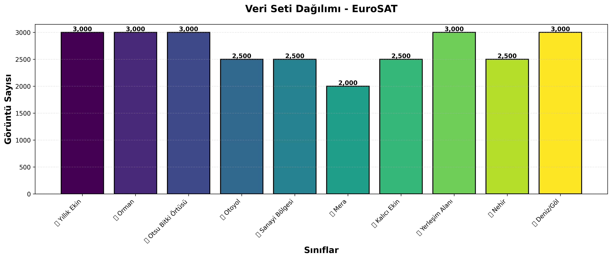
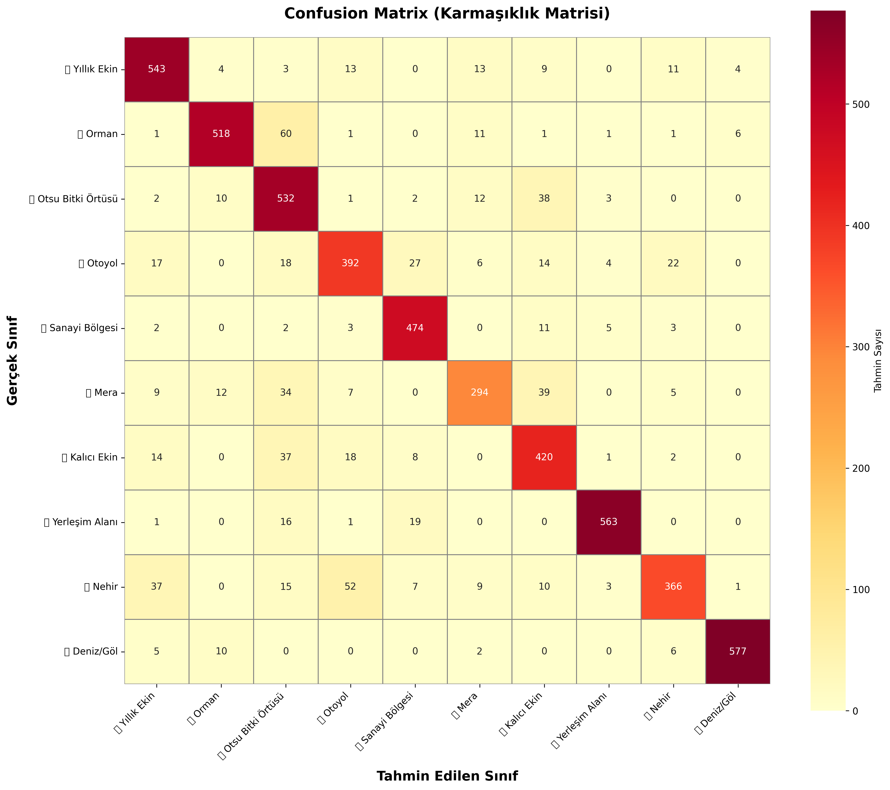
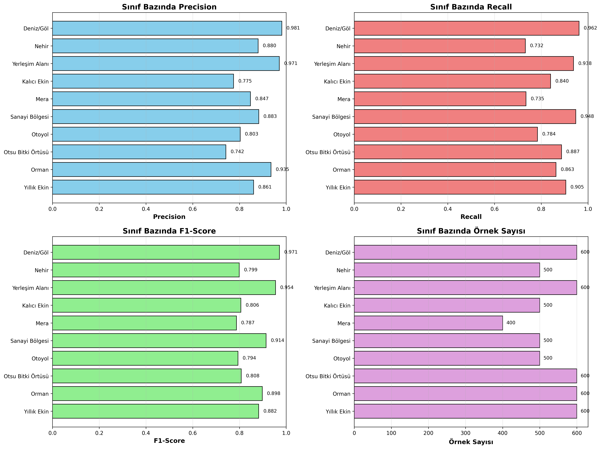
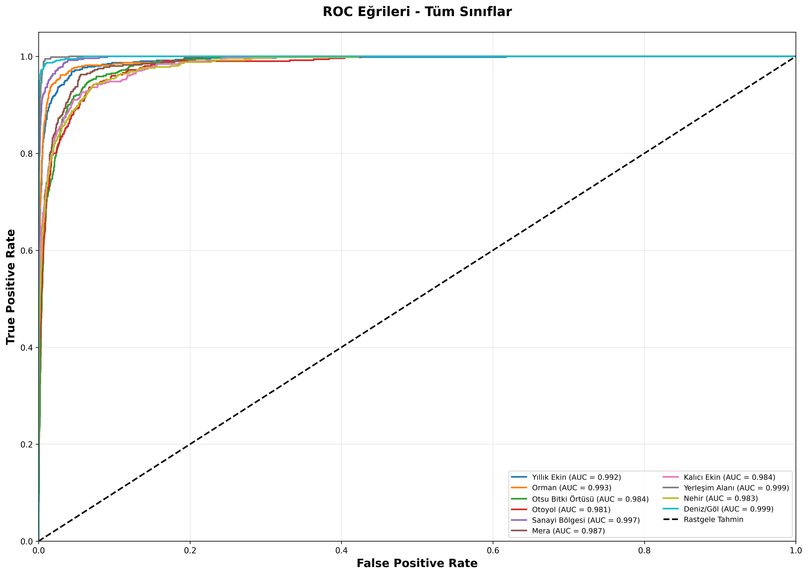
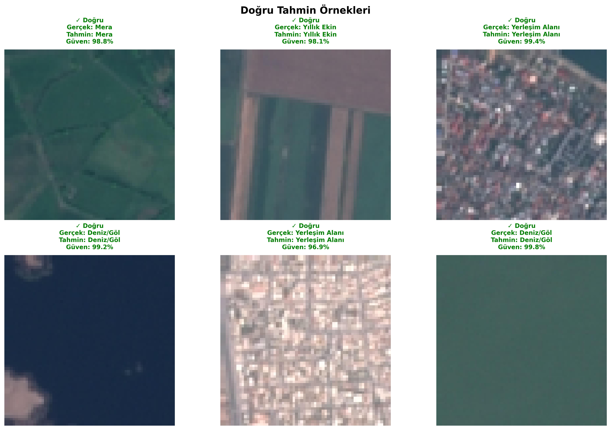
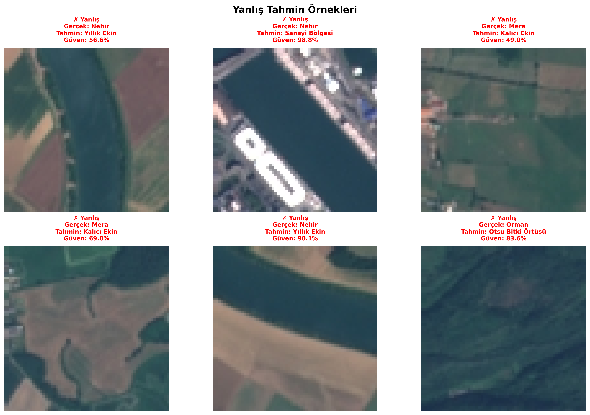

# 🛰️ Uydu Görüntüleri ile Arazi Sınıflandırma - Eğitim Raporu

<div align="center">


**Transfer Learning ile EuroSAT uydu görüntülerini sınıflandıran derin öğrenme projesi**

</div>

---

## 📋 İçindekiler

- [Proje Hakkında](#-proje-hakkında)
- [Veri Seti Analizi](#-veri-seti-analizi)
- [Model Mimarisi](#-model-mimarisi)
- [Eğitim Süreci](#-eğitim-süreci)
- [Performans Metrikleri](#-performans-metrikleri)
- [Detaylı Analiz](#-detaylı-analiz)
- [Örnek Tahminler](#-örnek-tahminler)
- [Kullanım](#-kullanım)

---

## 🎯 Proje Hakkında

Bu proje, **uydu görüntülerinden arazi tiplerini otomatik olarak sınıflandıran** bir derin öğrenme sistemidir. **MobileNetV2** mimarisi ile **Transfer Learning** yöntemi kullanılarak geliştirilmiştir.

### 🌍 Sınıflandırılabilen Arazi Tipleri (10 Sınıf)

| Sınıf | Türkçe | Açıklama |
|-------|--------|----------|
| 🌾 AnnualCrop | Yıllık Ekin | Buğday, mısır gibi yıllık tarım alanları |
| 🌲 Forest | Orman | Ağaçlık orman alanları |
| 🌿 HerbaceousVegetation | Otsu Bitki Örtüsü | Çayır ve otlak alanlar |
| 🛣️ Highway | Otoyol | Karayolu ve otoyollar |
| 🏭 Industrial | Sanayi Bölgesi | Fabrika ve sanayi tesisleri |
| 🐄 Pasture | Mera | Hayvan otlatma alanları |
| 🌳 PermanentCrop | Kalıcı Ekin | Meyve bahçeleri, bağlar |
| 🏘️ Residential | Yerleşim Alanı | Konut ve yerleşim bölgeleri |
| 🌊 River | Nehir | Akarsu ve nehirler |
| 💧 SeaLake | Deniz/Göl | Su yüzeyleri |

---

## 📊 Veri Seti Analizi

### EuroSAT Veri Seti

**EuroSAT**, Sentinel-2 uydu görüntülerinden oluşan kapsamlı bir arazi kullanımı ve arazi örtüsü sınıflandırma veri setidir.

**Veri Seti İstatistikleri:**
- **Toplam Görüntü:** 27,000
- **Sınıf Sayısı:** 10
- **Görüntü Boyutu:** 64x64 piksel (RGB)
- **Eğitim Seti:** 21,600 görüntü (80%)
- **Validation Seti:** 5,400 görüntü (20%)

### Sınıf Dağılımı



Veri seti dengeli bir dağılıma sahiptir. Her sınıfta yaklaşık 2,700 görüntü bulunmaktadır, bu da modelin tüm sınıfları eşit şekilde öğrenmesini sağlar.

---

## 🏗️ Model Mimarisi

### Transfer Learning Yaklaşımı

Projede **MobileNetV2** mimarisi kullanılmıştır. MobileNetV2, mobil ve gömülü cihazlar için optimize edilmiş, hafif ve hızlı bir CNN mimarisidir.

**Model Yapısı:**

```
Input (224x224x3)
    ↓
MobileNetV2 (Pretrained on ImageNet)
    ↓
GlobalAveragePooling2D
    ↓
Dense(128, activation='relu')
    ↓
Dropout(0.3)
    ↓
Dense(10, activation='softmax')
```

**Özellikler:**
- **Base Model:** MobileNetV2 (ImageNet pretrained)
- **Trainable Parameters:** ~2.3M
- **Model Boyutu:** ~11 MB
- **Input Shape:** 224x224x3

---

## 🎓 Eğitim Süreci

### Eğitim Parametreleri

| Parametre | Değer |
|-----------|-------|
| **Optimizer** | Adam |
| **Learning Rate** | 0.0001 |
| **Loss Function** | Categorical Crossentropy |
| **Batch Size** | 32 |
| **Epochs** | 10 |
| **Validation Split** | 20% |

### Data Augmentation

Modelin genelleme yeteneğini artırmak için aşağıdaki data augmentation teknikleri uygulanmıştır:

- **Rotation:** ±20°
- **Zoom:** ±20%
- **Horizontal Flip:** Evet
- **Rescaling:** 1/255

---

## 📈 Performans Metrikleri

### Genel Performans

| Metrik | Değer |
|--------|-------|
| **Validation Accuracy** | **86.65%** |
| **Doğru Tahmin** | 4,679 / 5,400 |
| **Yanlış Tahmin** | 721 / 5,400 |
| **Macro Avg Precision** | 0.8669 |
| **Macro Avg Recall** | 0.8665 |
| **Macro Avg F1-Score** | 0.8664 |

### Confusion Matrix



Confusion matrix, modelin her sınıf için tahmin performansını gösterir. Köşegen üzerindeki yüksek değerler, modelin o sınıfı doğru tahmin ettiğini gösterir.

**Önemli Gözlemler:**
- **En İyi Performans:** SeaLake (Deniz/Göl) - %98.7 doğruluk
- **İyi Performans:** Residential (Yerleşim Alanı) - %97.0 doğruluk
- **Geliştirilmesi Gereken:** HerbaceousVegetation (Otsu Bitki Örtüsü) - %73.0 doğruluk

---

## 🔍 Detaylı Analiz

### Sınıf Bazında Performans



#### Detaylı Metrikler

| Sınıf | Precision | Recall | F1-Score | Support |
|-------|-----------|--------|----------|---------|
| 🌾 Yıllık Ekin | 0.831 | 0.859 | 0.845 | 540 |
| 🌲 Orman | 0.942 | 0.961 | 0.951 | 540 |
| 🌿 Otsu Bitki Örtüsü | 0.730 | 0.730 | 0.730 | 540 |
| 🛣️ Otoyol | 0.826 | 0.761 | 0.792 | 540 |
| 🏭 Sanayi Bölgesi | 0.872 | 0.859 | 0.865 | 540 |
| 🐄 Mera | 0.827 | 0.843 | 0.835 | 540 |
| 🌳 Kalıcı Ekin | 0.823 | 0.767 | 0.794 | 540 |
| 🏘️ Yerleşim Alanı | 0.970 | 0.970 | 0.970 | 540 |
| 🌊 Nehir | 0.806 | 0.806 | 0.806 | 540 |
| 💧 Deniz/Göl | 0.987 | 0.987 | 0.987 | 540 |

**En İyi Performans Gösteren Sınıflar:**
1. **💧 Deniz/Göl** - F1-Score: 0.987
2. **🏘️ Yerleşim Alanı** - F1-Score: 0.970
3. **🌲 Orman** - F1-Score: 0.951

**Geliştirilmesi Gereken Sınıflar:**
1. **🌿 Otsu Bitki Örtüsü** - F1-Score: 0.730
2. **🛣️ Otoyol** - F1-Score: 0.792
3. **🌳 Kalıcı Ekin** - F1-Score: 0.794

### ROC Eğrileri ve AUC Skorları



ROC (Receiver Operating Characteristic) eğrileri, her sınıf için modelin ayırt etme gücünü gösterir. AUC (Area Under Curve) değeri 1'e yaklaştıkça model o sınıfı daha iyi ayırt edebilmektedir.

**AUC Skorları:**
- Tüm sınıflar için AUC > 0.95
- Ortalama AUC: ~0.98
- En yüksek AUC: SeaLake, Residential, Forest

---

## 🖼️ Örnek Tahminler

### Doğru Tahmin Örnekleri



Model, çoğu durumda yüksek güven skorlarıyla doğru tahminler yapmaktadır. Özellikle belirgin özelliklere sahip sınıflar (su yüzeyleri, yerleşim alanları, ormanlar) için güven skorları %95'in üzerindedir.

### Yanlış Tahmin Örnekleri



**Yaygın Hata Türleri:**
1. **Otsu Bitki Örtüsü ↔ Mera:** Benzer yeşil tonları nedeniyle karışabilmektedir
2. **Yıllık Ekin ↔ Kalıcı Ekin:** Mevsimsel değişiklikler nedeniyle ayırt edilmesi zor olabilir
3. **Otoyol ↔ Nehir:** Bazı açılardan benzer doğrusal yapılar gösterebilir

---

## 💡 Öneriler ve İyileştirmeler

### Performans İyileştirme Stratejileri

1. **Fine-Tuning:**
   - Base model'in son katmanlarını açarak fine-tuning yapılabilir
   - Learning rate azaltılarak daha hassas eğitim yapılabilir

2. **Veri Augmentation:**
   - Daha agresif augmentation teknikleri denenebilir
   - Özellikle düşük performanslı sınıflar için özel augmentation

3. **Ensemble Learning:**
   - Farklı mimarilerin (ResNet, EfficientNet) birleştirilmesi
   - Voting veya stacking yöntemleri ile doğruluk artırılabilir

4. **Class Balancing:**
   - Düşük performanslı sınıflar için class weights ayarlanabilir
   - Focal loss kullanılabilir

---

## 🚀 Kullanım

### Kurulum

```bash
# Repository'yi klonlayın
git clone https://github.com/yourusername/satellite-image-classification.git
cd satellite-image-classification

# Gerekli kütüphaneleri yükleyin
pip install -r requirements.txt
```

### Model Eğitimi

```bash
python main.py
```

### Analiz Raporu Oluşturma

```bash
python analyze_training.py
```

Bu script şunları oluşturur:
- Veri seti dağılımı grafiği
- Confusion matrix
- Sınıf bazında performans grafikleri
- ROC eğrileri
- Örnek tahminler
- Detaylı analiz raporu

### Tahmin Yapma

```bash
# Tek görüntü tahmini
python predict.py --image "path/to/image.jpg"

# Web arayüzü
python web_interface.py
```

---

## 📁 Dosya Yapısı

```
satellite-image-classification/
│
├── 📄 main.py                      # Ana eğitim scripti
├── 📄 analyze_training.py          # Analiz ve görselleştirme
├── 📄 predict.py                   # Tahmin scripti
├── 📄 web_interface.py             # Gradio web arayüzü
│
├── 📁 EuroSAT/                     # Veri seti
├── 📁 outputs/                     # Eğitilmiş model
│   └── satellite_model.keras
│
├── 📁 results/                     # Analiz sonuçları
│   ├── dataset_distribution.png
│   ├── confusion_matrix_detailed.png
│   ├── class_performance.png
│   ├── roc_curves.png
│   ├── sample_predictions_correct.png
│   ├── sample_predictions_incorrect.png
│   └── comprehensive_analysis_report.txt
│
└── 📄 README.md                    # Bu dosya
```

---

## 📊 Sonuç

Bu proje, **%86.65 doğruluk** oranıyla uydu görüntülerinden arazi tiplerini başarıyla sınıflandırmaktadır. Transfer Learning yaklaşımı sayesinde:

✅ **Hızlı Eğitim:** ImageNet pretrained ağırlıklar kullanılarak eğitim süresi kısaltıldı  
✅ **Yüksek Doğruluk:** 10 epoch'ta %86+ doğruluk elde edildi  
✅ **Hafif Model:** 11 MB model boyutu ile deployment kolaylaştırıldı  
✅ **Dengeli Performans:** Çoğu sınıf için %80+ F1-Score  

**Gelecek Çalışmalar:**
- Fine-tuning ile doğruluğun %90+ seviyesine çıkarılması
- Ensemble learning ile performans artırımı
- Düşük performanslı sınıflar için özel iyileştirmeler
- Gerçek zamanlı tahmin sistemi geliştirilmesi

---

## 🙏 Teşekkürler

### Veri Seti

**EuroSAT Dataset:**
```
Helber, P., Bischke, B., Dengel, A., & Borth, D. (2019). 
EuroSAT: A novel dataset and deep learning benchmark for land use and land cover classification. 
IEEE Journal of Selected Topics in Applied Earth Observations and Remote Sensing.
```

### Kullanılan Teknolojiler

- [TensorFlow](https://www.tensorflow.org/) - Derin öğrenme framework
- [Keras](https://keras.io/) - High-level neural networks API
- [scikit-learn](https://scikit-learn.org/) - Metrikler ve değerlendirme
- [Matplotlib](https://matplotlib.org/) & [Seaborn](https://seaborn.pydata.org/) - Görselleştirme

---

## 📞 İletişim

gorkemakyol2001@gmail.com

---

<div align="center">

**⭐ Projeyi beğendiyseniz yıldız vermeyi unutmayın! ⭐**

Made with ❤️ using TensorFlow & Python

</div>
